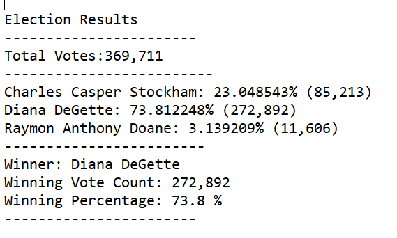

# Election_Analysis
## Overivew of Election Audit
### The purpose of the election was to help Seth and Tom determine the results from the election results. It was requested for more information about the election to provide an overall summary of the winnings. 

## Election_Audit Results
### Below is an image of the overall results for reference: 
* There were 369,711 votes in the congressional election.
* Below is the breakdown of the county votes:
    * Jefferson had 10.5% of votes 
    * Denver had 82.8% of votes
   * Arapahoe had 6.7% of votes
  
* Denver was the largest number county turnover.

* Below is the candidate overall summary:
   * Charles Casper Stockham had about 23% votes(85,213).
   * Diana Degette had about 74% votes(272,892). 
   * Raymon Anthony Doana had about 3% votes (11,606). 
 

Election-Audit Summary: In a summary statement, provide a business proposal to the election commission on how this script can be used—with some modifications—for any election. Give at least two examples of how this script can be modified to be used for other elections.

##Election Audit Summary
###This script can be modified to help calculated the state election, not just county.  This can help provide more information to help compare between different states the overall results.  If we had this in one data set, we can right condition statements to separate out the data results and provide comparison information between the states. 

###We can provide a little more information on who won the Denver election since that was the largest county turnout.  This would provide more information as to which candidate did the best and what tactics did they do to win the election. 
